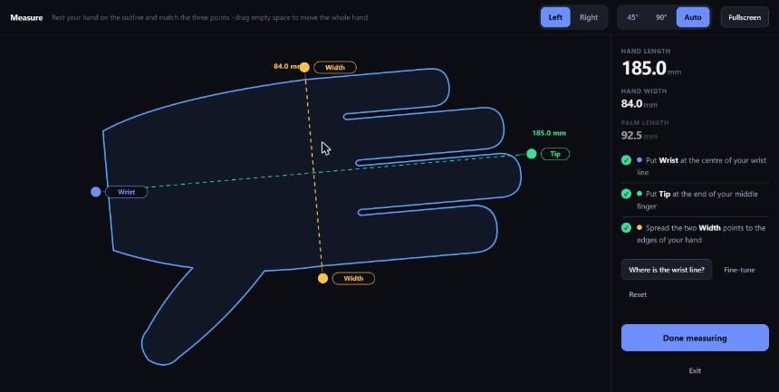
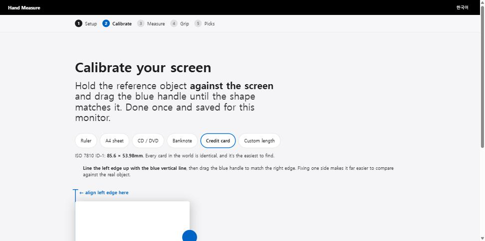
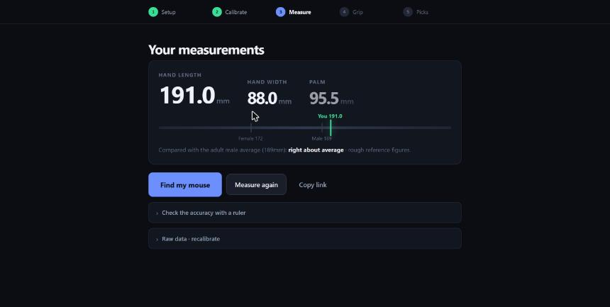
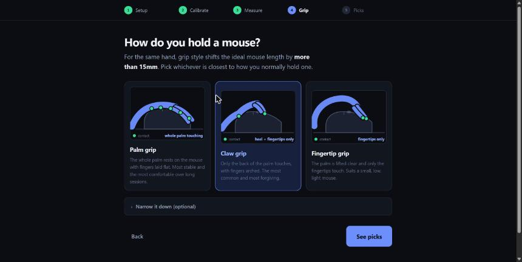
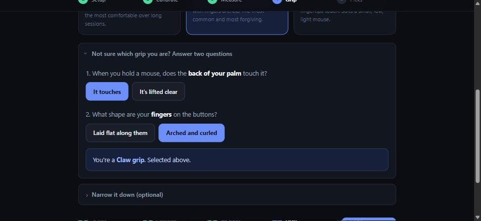
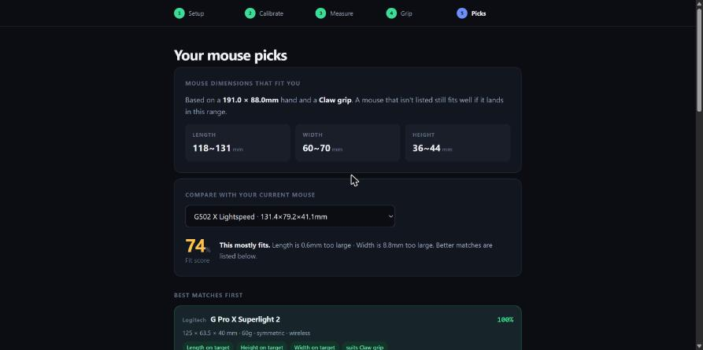
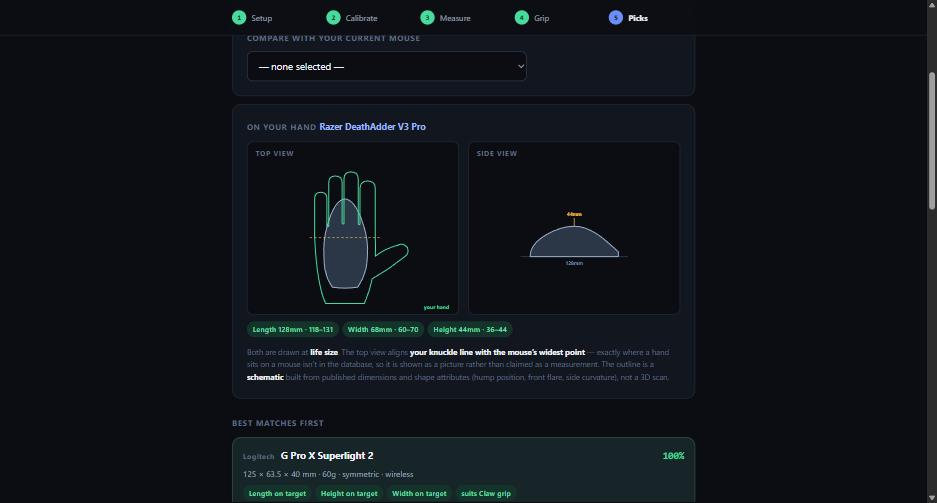
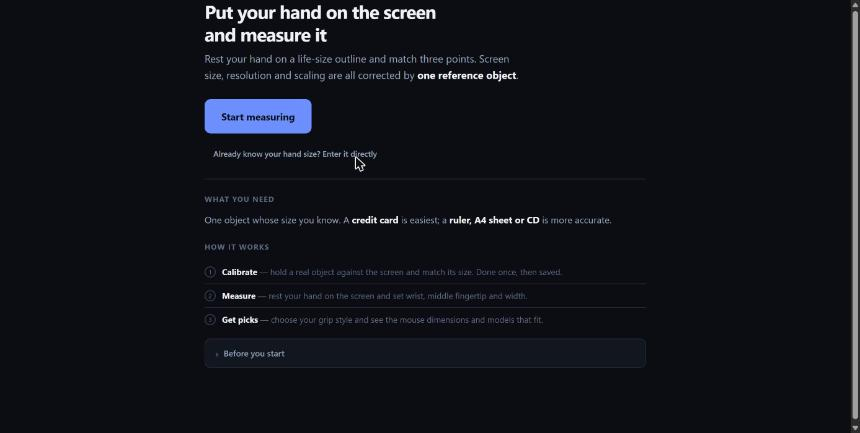

<div align="center">

<br>

# Hand Measure

### Measure your hand against your monitor.<br>Find the mouse that actually fits.

<br>

[](https://jinwovo.github.io/hand-measure/)
[](LICENSE)
[](#running-it)

<br>



<br><br>

**English** · [한국어](#한국어)

</div>

<br>

---

## The problem

Mouse sizing charts want your hand length in millimetres. Almost nobody knows theirs, and a
guess that's off by a centimetre changes the answer completely.

You already own a precisely manufactured measuring surface: your monitor. The only obstacle
is that a browser has no idea how physically large its own pixels are.

## The trick

Browsers cannot report physical DPI. CSS `mm` and `in` are fictions pinned to `96px = 1in`;
`devicePixelRatio` describes density, not size.

So don't *derive* the screen scale — measure it once:

```
pxPerMm = reference object's width in CSS px ÷ its real width in mm
```

That single number absorbs **panel DPI, OS scaling, Retina and browser zoom** at once.
Everything after it is arithmetic.

<div align="center">

</div>

Hold a credit card against the screen and drag until they match — ISO 7810 ID-1 is exactly
85.60 × 53.98 mm worldwide. Ruler, A4 and CD are offered too (bigger reference, smaller
relative error), plus a **custom length** for anything you can measure.

> A 3 px misalignment on a credit card is ~0.9%, about 1.8 mm on a 190 mm hand. Mouse size
> brackets are ~10 mm wide. **Calibration is not the bottleneck** — placing the wrist
> landmark is.

<br>

## What it does

### 1 · Calibrate, once per monitor

Stored keyed by display signature, so a dual-monitor setup keeps one calibration per screen
rather than overwriting. Browser zoom changes are detected and flagged.

### 2 · Measure

A life-size hand outline appears. Drag three points — wrist, middle fingertip, width.
Everything else about the outline is cosmetic and tucked behind a fine-tune toggle.

<div align="center">

</div>

The result is placed against adult averages, so a number becomes a sense of scale.

### 3 · Identify your grip

Grip shifts the ideal mouse length by **more than 15 mm** for the same hand, which makes it
as decisive as the measurement.

<div align="center">

</div>

Each grip is drawn in profile with its contact points marked — where the hand touches is
the whole difference between them. But it's also the thing people are least sure about, so
there's a two-question diagnostic rather than three cards and a shrug:

<div align="center">

</div>

Does the back of your palm touch the mouse? Are your fingers flat or arched? Those two
questions are the actual definitional differences between the three grips.

### 4 · Get dimensions, then see them on your hand

<div align="center">

</div>

**The target range is the real output** — it works for mice the database has never heard of.
Below it, 63 models ranked, searchable, with your current mouse scored against your hand:

> **74%** — This mostly fits. Length is 0.6 mm too large · Width is 8.8 mm too large.

Click any mouse and it's drawn **at life size against your own hand outline**:

<div align="center">

</div>

<br>

## Design notes

<details>
<summary><b>The wrist landmark is on the wrong side of your hand</b></summary>
<br>

Standard anthropometric hand length runs from the **distal wrist crease** to the middle
fingertip. That crease is on your *palm* — invisible the moment your palm is against the
screen.

So the tool uses the **stylion line** instead: the line joining the two bony prominences
(radial and ulnar styloid) either side of the wrist. Anatomically the same height, visible
from the back of the hand.

Misplacing it costs 5–10 mm, several times worse than calibration error, which is why it
gets a dedicated guide screen.

</details>

<details>
<summary><b>Why there is no 3D model</b></summary>
<br>

The database holds bounding-box dimensions and categorical shape attributes — not geometry.
A 3D render would have to invent every curve, and 3D reads as far more authoritative than a
diagram, so it would present fiction as measurement.

The fit preview is a schematic built strictly from published numbers, and its caption says
so. It carries exactly one alignment assumption — knuckle line over the mouse's widest point
— which is stated in words rather than converted into a figure.

An earlier version of that preview printed *"your fingertips reach 46.9 mm past the front"*
for a mouse the engine scored at 100%. The number came from a made-up constant for where a
hand sits on a mouse. It's gone.

</details>

<details>
<summary><b>Your left hand is on the screen, your right hand is on the mouse</b></summary>
<br>

You need a free hand for the mouse, so most people measure the other one. Dominant and
non-dominant hands differ by roughly 1–2% in length, comfortably inside the tolerance that
would change a recommendation. The tool says so and moves on rather than pretending to
correct for it.

</details>

<details>
<summary><b>A life-size hand doesn't fit on most screens</b></summary>
<br>

A 185 mm hand needs nearly 700 px of height at typical scaling. The measuring step goes
fullscreen by default, can lay the hand diagonally, and lets you drag anywhere to pan.

On a phone it's impossible — the hand is physically larger than the display. Small screens
are told that plainly and offered direct numeric entry instead of a degraded flow.

</details>

<details>
<summary><b>Measurements are rotation-invariant, which is what makes auto-fit safe</b></summary>
<br>

Hand length is `distance(wrist_midpoint, fingertip)`; width is
`distance(knuckle_left, knuckle_right)`. Both are point-to-point distances, so tilting the
hand changes nothing. That's why the outline can be rotated freely to fit the viewport.

</details>

<br>

## Recommendation model

Mouse length and height score against **hand length**; width against **hand width**.

| Grip | Length ÷ hand length | Width ÷ hand width | Height ÷ hand length |
|---|---|---|---|
| Palm | 0.655 – 0.720 | 0.700 – 0.820 | 0.205 – 0.245 |
| Claw | 0.620 – 0.685 | 0.680 – 0.800 | 0.190 – 0.230 |
| Fingertip | 0.575 – 0.645 | 0.650 – 0.780 | 0.170 – 0.210 |

Each dimension scores 1.0 at the **centre** of its band and tapers outward — a flat 1.0
anywhere inside tied the whole top of the list at 100%. Weights: length 52% · height 22% ·
width 20% · grip hint 6%.

> [!IMPORTANT]
> **These ratios are community guidance, not measured data.** They need correcting against
> real "did the recommended mouse actually fit?" feedback. Treat the output as a strong
> hint, not a verdict.

<br>

## Where the mouse data comes from

62 of 63 entries are cross-checked against [eloshapes.com](https://www.eloshapes.com/), which
measures 1600+ mice the same way. **41 needed correcting** — the widths especially:

| Mouse | Was | Now |
|---|---|---|
| Razer Viper V2 Pro | 57.6 mm wide | **66.0 mm** |
| Razer DeathAdder V2 | 61.7 mm wide | **70.0 mm** |
| Corsair Sabre RGB Pro | 61.2 mm wide | **69.0 mm** |
| VAXEE Outset AX | 126 mm long | **117.4 mm** |

That width pattern is the grip-width-vs-widest-point problem in action, and it's why the
database uses **one source measured one way** instead of the best figure from whoever
published it. A recommendation engine compares dimensions against each other, so internal
comparability matters more than matching any single manufacturer.

Four shape attributes per mouse — hump placement, front flare, side curvature, thumb rest —
come from the same source. They drive the fit preview drawing only and are **excluded from
scoring**, because they're categorical judgements rather than measurements.

<br>

## Running it

```bash
git clone https://github.com/jinwovo/hand-measure.git
cd hand-measure
open index.html        # or just double-click it
```

No install, no build, no CDN, no network calls. Opening the file directly works. Some
browsers block `localStorage` on `file://`, so calibration and language won't persist; for
those, `python -m http.server 8000`.

| File | What it is |
|---|---|
| `index.html` | The whole app — markup, styles, geometry, recommendation engine |
| `i18n.js` | String dictionary, English + Korean (242 keys each) |
| `mice.js` | Mouse specification database |

**Results are links.** `index.html#len=191&wid=88&grip=claw` jumps straight to the
recommendations, no measuring required.

**Keyboard operable.** <kbd>Tab</kbd> cycles the handles, <kbd>arrows</kbd> nudge 1 px
(<kbd>Shift</kbd> 5 px), <kbd>Esc</kbd> deselects. With nothing selected, arrows pan the
whole hand.

<br>

## Contributing

The database is thinnest at the extremes — very small and very large hands — which is
exactly where recommendations are weakest. Vertical mice and trackballs aren't represented
at all.

```js
{ id:"logi-gpxs2", brand:"Logitech", name:"G Pro X Superlight 2",
  l:125, w:63.5, h:40, g:60, shape:"sym", wl:true,
  hump:0.5, flare:1, curve:0, grips:["claw","fingertip","palm"], price:3, ver:true },
```

Use [eloshapes.com](https://www.eloshapes.com/) for figures so widths stay comparable with
the rest of the database, and link the source in your PR. See [CONTRIBUTING.md](CONTRIBUTING.md).

**The most valuable contribution isn't code.** If a recommendation was wrong for you, open
an issue with your hand size, your grip, and what you actually use. That's the data the
ratio bands need, and it can't be derived from anything else.

<br>

## Known limitations

- **Grip ratios are unvalidated.** Community guidance, not measurement.
- **Specs are third-party, not manufacturer.** Consistent for comparison; confirm before buying.
- **The wrist landmark is user-judged.** The guide helps; it stays the dominant error term.
- **Phones can't do this.** Physics, not a bug. Direct entry is offered instead.
- **Palm length is informational.** Not used in scoring yet.

<br>

---

## 한국어



모니터에 손을 대고 실제 크기 윤곽선에 맞추면 **손 길이·너비를 mm로 재고**, 그립 방식에 맞는
마우스 치수와 모델을 추천합니다. 설치 없이 `index.html` 하나만 열면 됩니다.

**핵심 아이디어** — 브라우저는 자기 픽셀의 물리적 크기를 모릅니다. CSS의 `mm`·`in`은
`96px = 1in`에 고정된 허구이고 `devicePixelRatio`도 밀도일 뿐입니다. 그래서 화면 배율을
*계산*하지 않고 **기준물로 한 번 실측**합니다. 이 값 하나가 패널 DPI, OS 배율, 레티나,
브라우저 확대를 전부 흡수합니다.

**손목 기준선** — 표준 기준점인 손목 주름은 손바닥 쪽에 있어 화면에 붙이면 보이지 않습니다.
손등에서 보이는 **뼈 돌출부 2개를 잇는 선**(stylion line)이 해부학적으로 같은 높이라 이쪽을
씁니다. 이 지점이 전체 오차의 가장 큰 원인이라 전용 가이드 화면을 뒀습니다.

**그립 진단** — 그립은 추천을 가장 크게 흔드는 입력인데 정작 가장 모르는 항목입니다.
"손바닥 뒤쪽이 닿나요 / 손가락이 펴져 있나요" 두 가지만 물으면 세 그립이 갈립니다.

우측 상단에서 언어를 전환합니다. 기여는 `mice.js`에 마우스를 추가하는 것, 그리고
**추천이 틀렸다면 손 크기·그립·실제 쓰는 모델을 이슈로 알려주시는 것**이 가장 값집니다.

<br>

---

<div align="center">

MIT License · [LICENSE](LICENSE)

<sub>Mouse specifications in <code>mice.js</code> are factual measurements published by their manufacturers.<br>
Brand and product names are trademarks of their respective owners.<br>
This project is not affiliated with, endorsed by, or sponsored by any of them.</sub>

</div>
